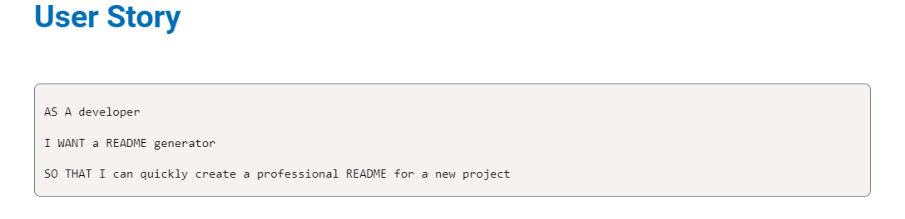
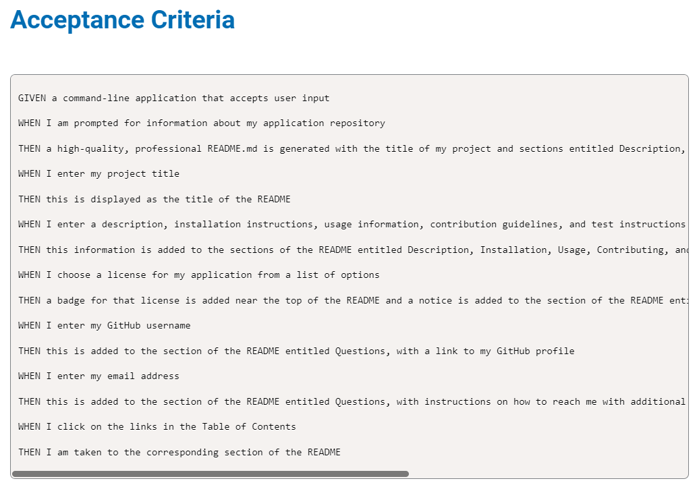

# Node.js Challenge

## Table of Contents

- [Description](#description)
- [Installation](#installation)
- [Tests](#tests)
- [Tests](#tests)
- [License](#license)

## Description
To create a command line application that generates a professional readme file from a users input using inquirer

## Installation
To install inquirer type in inquirer@8.2.4

## Tests
To test you will right click on your index.js file and open the terminal and then type in node.js and then continue with the prompts.

## Resources
Here are the resources used in this project:
- Xpert, stackoverflow, w3 schools

## License
This project is licensed under the MIT license. Click [here](https://choosealicense.com/licenses/mit/) for more information.

## Questions
For additional questions, contact Yvonne Wantings at yowantings@gmail.com. Visit [GitHub](https://github.com/yvonneewa) to view more of their work.

